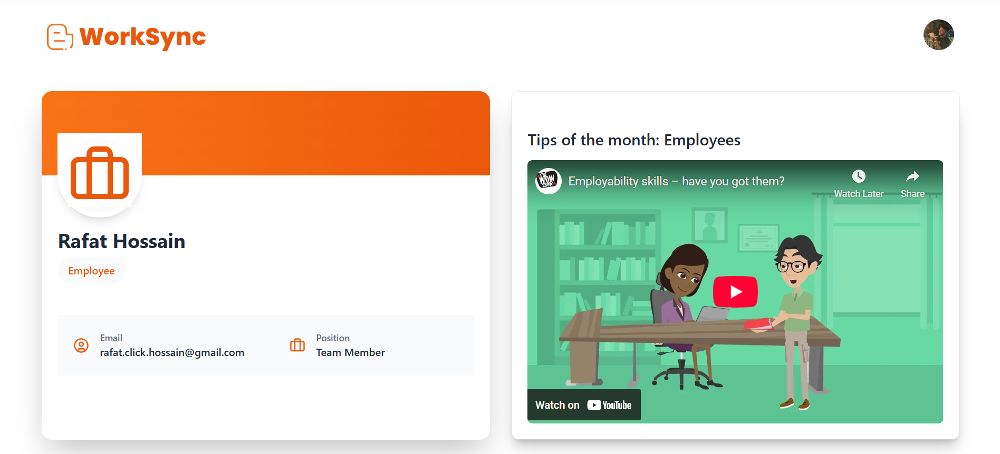
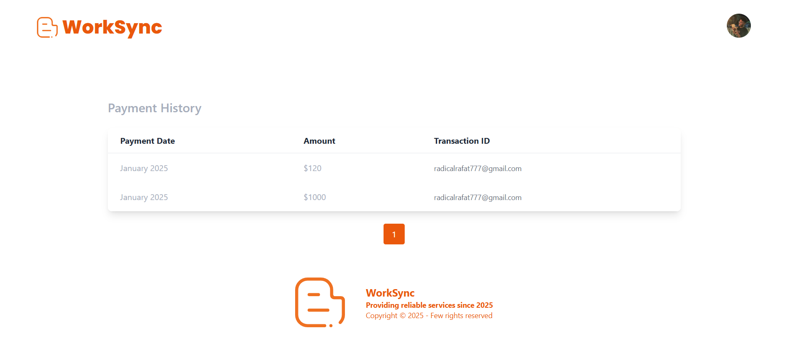
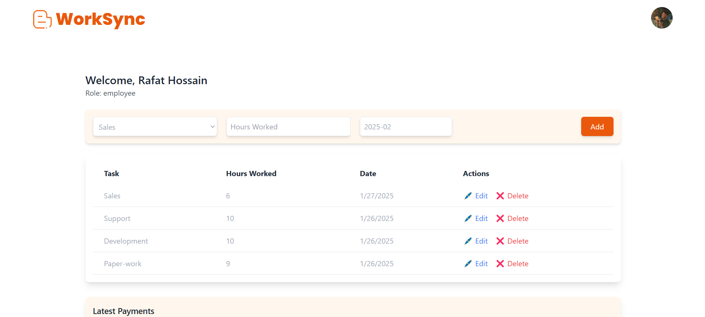
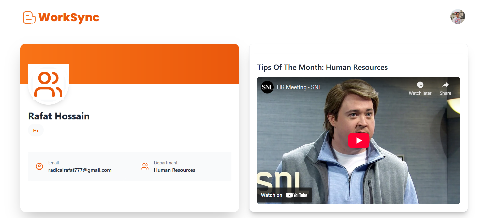
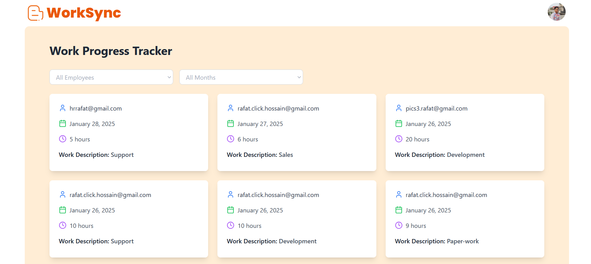
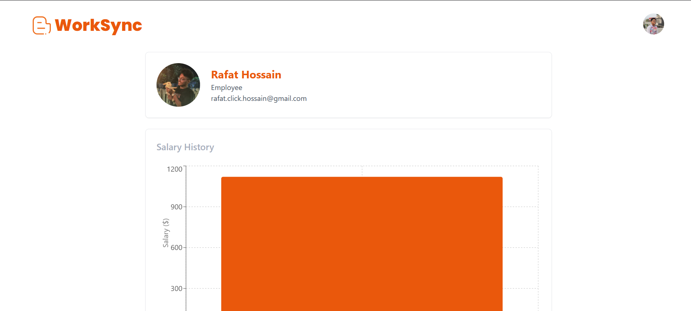
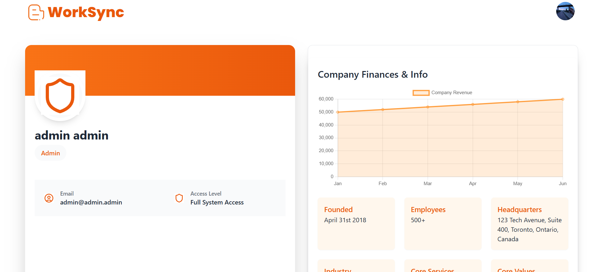
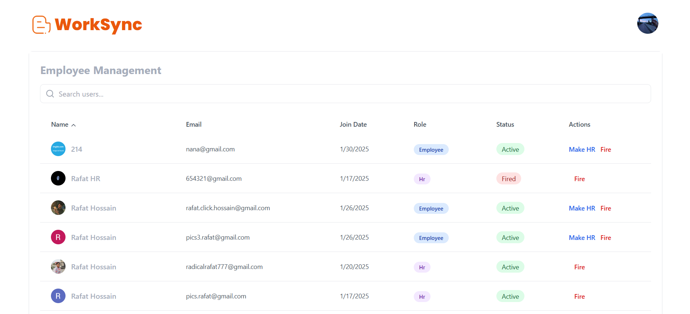
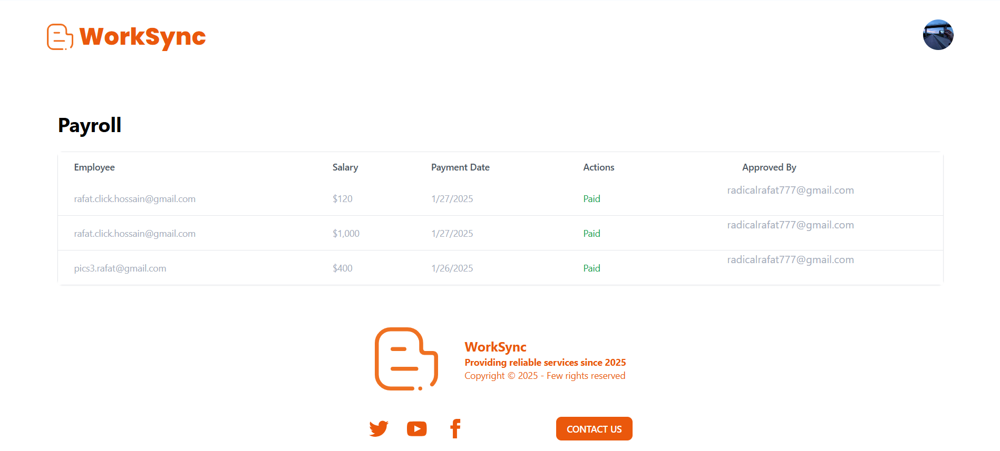

# WorkSync
## Full-Stack Employee Management System
**Tech Stack:** React.js | Node.js | MongoDB | Firebase | JWT | TanStack Table


## About WorkSync
**WorkSync** is a **full-stack web application** designed to streamline **employee management**. With a focus on enhancing **HR operations**, this platform allows **employees** to log **work hours**, track **salary history**, and manage **payroll**, while **HR** and **Admin** users can oversee **employee performance**, **salary payments**, and other critical workflows.

The platform supports **role-based access** for different user types, including **Employees**, **HR Executives**, and **Admins**, ensuring that each user has access to the appropriate resources and features based on their role.


## Technologies Used
- **Frontend:** React.js, TanStack Table, React Query
- **Backend:** Node.js, Express.js
- **Database:** MongoDB
- **Authentication:** Firebase Authentication (Email/Password & Social Login)
- **State Management:** React Context API
- **Security:** JWT (JSON Web Token) for role-based authentication
- **Notifications:** SweetAlert & Toast for user-friendly notifications


## 🔐 Roles & Permissions at a Glance  
Here’s how power is distributed in WorkSync:  

- **Admin:**  
  - Manages employee data, salaries, and payments.  
  - Creates/removes HRs, bans users, and promotes employees.  
  - Approves/denies payment requests and processes payouts.  
  - Full search, filter, and overview capabilities.  

- **HR:**  
  - Verifies employees and tracks their work progress.  
  - Manages payroll—processes, approves, or declines requests.  
  - Views employee lists, details, and salary histories.  

- **Employee:**  
  - Logs hours, tasks, and dates; submits payment requests.  
  - Tracks payment history and request statuses.  
  - Starts with default Employee role via email/Google login.  

WorkSync blends functionality with flexibility, making workforce management a breeze for everyone involved. Ready to dive in?


## Demo
<a href="https://worksync-2ca3b.web.app" target="_blank">Live Demo</a>

> **Note:**  
> Users can only log in as an Employee for security purposes.
> Message me if you'd like to have access as an HR or Admin.


## **Screenshots**

Here are some key screenshots of the application:

### **Employee Pages:**
- **Dashboard**
    
  *Employee Dashboard*

- **Past Payments**
    
  *Employee View of Past Payments*

- **Add Payment**
    
  *Employee Add Payment Request*

### **HR Pages:**
- **Dashboard**
    
  *HR Dashboard*

- **Employee List**
    
  *HR View of Employee Table*

- **Payroll**
    
  *HR View of Payroll Table*

- **Employee Details**
    
  *HR View of Employee Details*

### **Admin Pages:**
- **Dashboard**
    
  *Admin Dashboard*

- **All Employees**
    
  *Admin View of All Employees*

- **Payroll**
    
  *Admin Payroll Management*


## 🌟 Features & Roles: Powering WorkSync

**WorkSync** brings a seamless **employee management** experience with tailored features and permissions for every role. Whether you're an **Employee** tracking your hours, an **HR Executive** managing payroll, or an **Admin** overseeing the entire system, **WorkSync** has you covered with **intuitive tools** and **robust controls**.


### 👩‍💼 For Employees  
Empower your workforce with tools to stay organized and informed:  
- **Work Logs:** Track and submit work hours, task types, and completion dates with ease.  
- **Salary History:** View your monthly payment history, including the latest and past payouts.  
- **Payment Requests:** Submit requests for your work hours, monitor their status as HR reviews and Admin approves.  
- **Notifications:** Get instant toast notifications for successful logins, updates, and CRUD operations.  
- **Default Access:** Log in with Google or email, and you're automatically set as an Employee—ready to roll!

### 👨‍💼 For HR Executives  
Streamline payroll and performance tracking with HR-focused features:  
- **Employee Management:** Verify employees, review their details, and monitor performance across tasks, hours, and completion dates.  
- **Payroll Power:** Process payment requests, accept or decline them, and forward approved requests to Admin for final sign-off.  
- **Full Visibility:** Access the entire employee list, dive into salary histories, and track work progress with a single click.  
- **Oversight:** See who’s doing what, when, and how—keeping workflows smooth and efficient.

### 👑 For Admins  
Take command with unmatched control and oversight:  
- **Employee Overview:** View all employees (including HRs), search or filter by name/role, and manage their fates—promote to HR, adjust salaries, or remove them entirely.  
- **Salary Adjustments:** Boost employee salaries with precision (increases only).  
- **Payment Mastery:** Review HR-forwarded payment requests, approve or decline, and execute payouts with final confirmation.  
- **Role Management:** Create HR users, ban employees, or reshape the team as needed—all from one dashboard.  
- **Total Access:** See every detail, from work logs to payment statuses, ensuring nothing slips through the cracks.


## 📚 API Documentation

### 👥 User Management

#### 🔍 Get User by UID
**Endpoint:** `GET /users/:uid`  
**Description:** Retrieve details of a specific user by their Firebase UID  
**Response:**  
```json
{
  "_id": "string",
  "name": "string",
  "email": "string",
  "userType": "admin|hr|employee",
  "status": "active|fired",
  "createdAt": "ISO date"
}
```

#### 📋 Get All Users
**Endpoint:** `GET /users`

**Description:** Get all non-admin users

**Response:** Array of user objects

#### 📝 Register User
**Endpoint:** `POST /users`

**Body:**
```json
{
  "name": "string",
  "email": "string",
  "photoURL": "string",
  "uid": "string",
  "userType": "admin|hr|employee"
}
```

#### ⬆️ Promote to HR
**Endpoint:** `POST /make-hr/:id`

**Description:** Promote an employee to HR role

**Params:** MongoDB document ID

### ❓ Queries

#### ✉️ Submit Query
**Endpoint:** `POST /submit-query`

**Body:**
```json
{
  "heading": "string",
  "designation": "string",
  "details": "string",
  "email": "string"
}
```

#### 📨 Get Queries
**Endpoint:** `GET /queries`

**Query Params:** ?email=user@example.com

**Response:** Array of query objects

### 📅 Worksheet Management
#### ➕ Create Worksheet Entry
**Endpoint:** `POST /worksheet`

**Body:**
```json
{
  "email": "string",
  "hoursWorked": "number",
  "date": "ISO date"
}
```

#### 📂 Get Worksheet Entries
**Endpoint:** `GET /worksheet/:email`

**Response:** Array of worksheet entries for specified user

### 💰 Payments
#### 💸 Process Payment
**Endpoint:** `POST /process-payment`

**Body:**
```json
{
  "email": "string",
  "amount": "number",
  "paidBy": "string",
  "entries": ["array of entry IDs"]
}
```

#### 📊 Get Payment History
**Endpoint:** `GET /payment-history/:email`

**Response:**
```json
{
  "payments": [
    {
      "month": "string",
      "salary": "number",
      "approvedBy": "string"
    }
  ]
}
```

#### ⏳ Check Pending Payments
**Endpoint:** `GET /check-pending-payment/:email`

**Response:**
```json
{
  "hasPendingPayment": "boolean",
  "pendingPayment": "object|null"
}
```

### 💼 Salary Management
#### 📈 Adjust Salary
**Endpoint:** `POST /adjust-salary/:id`

**Params:** MongoDB document ID

**Body:**
```json
{ "salary": "number" }
```

### 📜 Get Salary History
**Endpoint:** `GET /salary-history/:id`

**Response:** Array of salary adjustment objects


## 📬 Contact
For any questions or support, please contact:

📧 [Email](mailto:rafat.click.hossain@gmail.com)

👔 [LinkedIn](https://www.linkedin.com/in/muhammad-rafat-hossain/)

**Let's connect! 🤝**